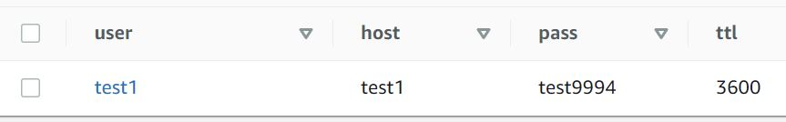
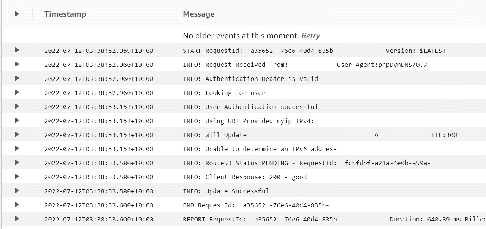
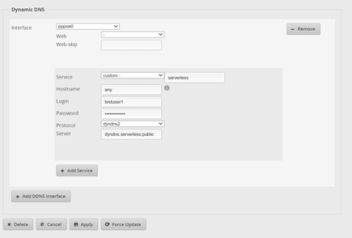
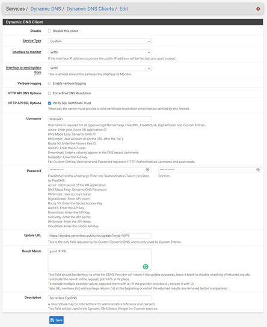

# Implement a Serverless Dynamic DNS Server (DynDNS Compatible) using AWS API Gateway, Lambda and DynamoDB


## Table of Contents

- [Overview](#overview)
- [How It Works](#how-it-works)
- [Getting Started](#getting-started)
- [Deployment](#deployment)
- [Operation](#operation)
- [Conclusion](#conclusion)
- [Example Client Configuration](#example-client-configuration)


## **OVERVIEW**

DynDNS is a Specification used by many internet firewalls and routers to allow them to be identified by a friendly name when used on a typical Internet connection without a static IP Address. Ie Home Routers. Typically this service is provided by a 3rd party subscription service. This example implements the fundamentals of the specification.

This allows you to connect to services like CCTV, Raspberry Pi Projects, etc… along with NAT Rules Router on your router.

To provide AWS Services we can implement a service DynDNS that provides the basic functionality with a custom domain name, and at a very low cost and high availability.

This example Lambda Function supports a single host per username, not implementing the ‘Host’ field in the DynDNS protocol, this simplifies the implementation. It also implements Basic authentication stored clear text in the dynamo Database.


## **HOW IT WORKS**


For this implementation we are using the AWS SAM (Serverless Application Model) using a serverless API and Function to simplify the deployment of the application and provide the serverless API to host our Dynamic DNS Server. We utilise Amazon Certificate Manager on our specified hostname to allocate a TLS certificate to the API Gateway to ensure security of the API service.

Using the DYNDNS API Specification (https://help.dyn.com/remote-access-api/) we then implement the API to update client records and implement authentication to support client authentication.

To store the records we can use a simple DynamoDB Table to hold the required configuration for each client. For this example we are storing a simple username and password, along with the hostname and the TTL for the associated DNS record. This hostname will be updated in the specified Route53 Zone.




## **GETTING STARTED**

For this deployment we will use the AWS SAM (Serverless Application Model). Make sure you have installed the AWS Serverless Application Model CLI, setup AWS credentials, and created a bucket to store SAM artefacts in.

Refer to here for OS specific setup:
(https://docs.aws.amazon.com/serverless-application-model/latest/developerguide/serverless-getting-started.html)

This pattern required an existing Public Route53 Hosted Zone created that you want to use to host the DDNS records. You will need both the name and Zone ID.
An existing working SAM setup with IAM role, including an S3 bucket for SAM to deploy the Lambda function to.


## **DEPLOYMENT**

Clone the Git Repository (https://github.com/steven-geo/aws-serverless-dyndns-server)

Edit the ```./scripts/prj_var.sh``` file to customise the SAM and DDNS Configuration parameters. Set the appropriate SAM Artefact bucket, and DDNS, log retention days (as per CloudWatch requirements), the Domain Name and ID of the domain we want to use to update ddns client addresses, and also the FQDN we want our API to run on.
From the root of the git repository run the ```./scripts/sam_package.sh```, then the ```./scripts/sam_deploy.sh``` script to deploy the AWS Serverless Template and create the CloudFormation stack.


## **OPERATION**

DDNS has a few different implementation types, for this implementation we will follow the DynDNS method. This involves HTTP/HTTPS Requests with a specific API schema.

To test the installation there are two additional scripts
```./scripts/db_load.sh```

This script will create a test entry into the DynamoDB. This record will then be used by our test client.
```./scripts/test_ddns_curl.sh```

Using this command we can test the DDNS API using the user details created in the ```db_load.sh``` file. This will create/update a DDNS record with the IP Address of the client running this command.

Once you run this test, you should see host record appear in your Route 53 Zone. 
Checking CloudWatch you will see the request to update the record logged




## **CONCLUSION**

This example shows how a Dynamic DNS Service can be hosted for almost free on AWS, to service remote clients Whilst this only implements the basic functionality, it could easily be expanded to support additional features if required. Some of the future enhancements could be:

•	Rate Limiting to prevent DDoS

•	Support for Hostnames (part of DynDNS specification)

•	Check if IP address is the same as previous (request but no update)

•	Event driven Notifications (SNS Topic) to email or notify for other actions


## **EXAMPLE CLIENT CONFIGURATION**

### **Ubiquiti EdgeRouter**



### **PFSense**


